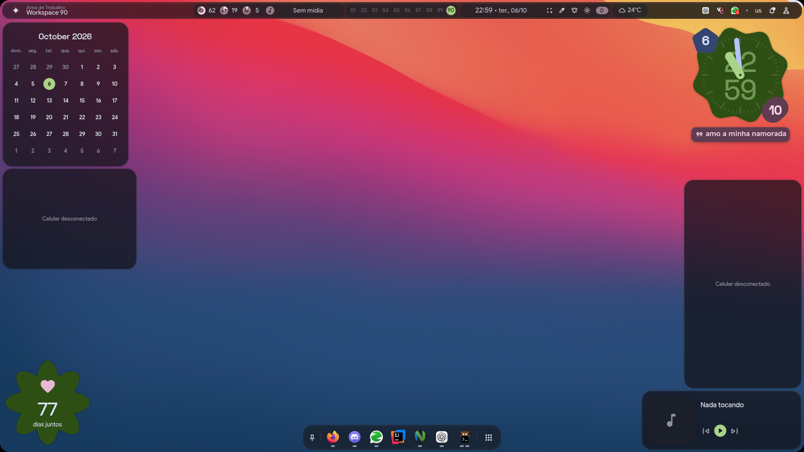
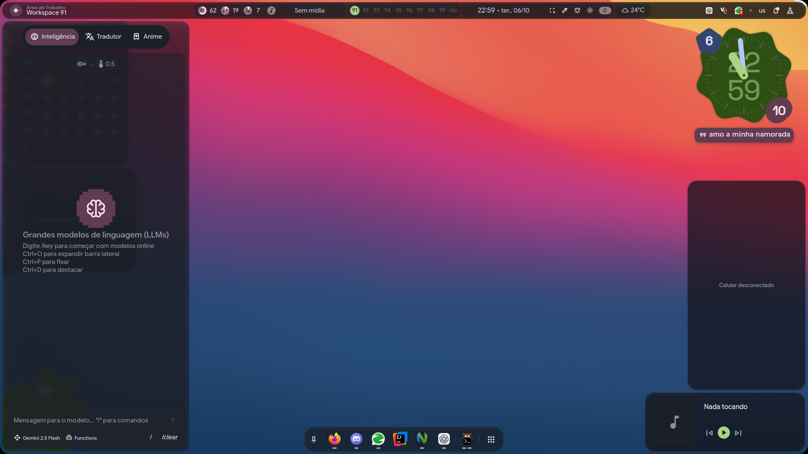
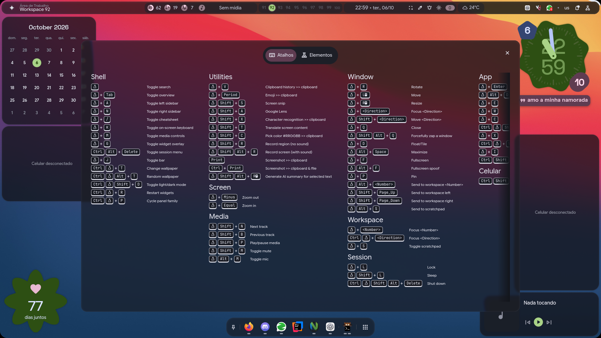
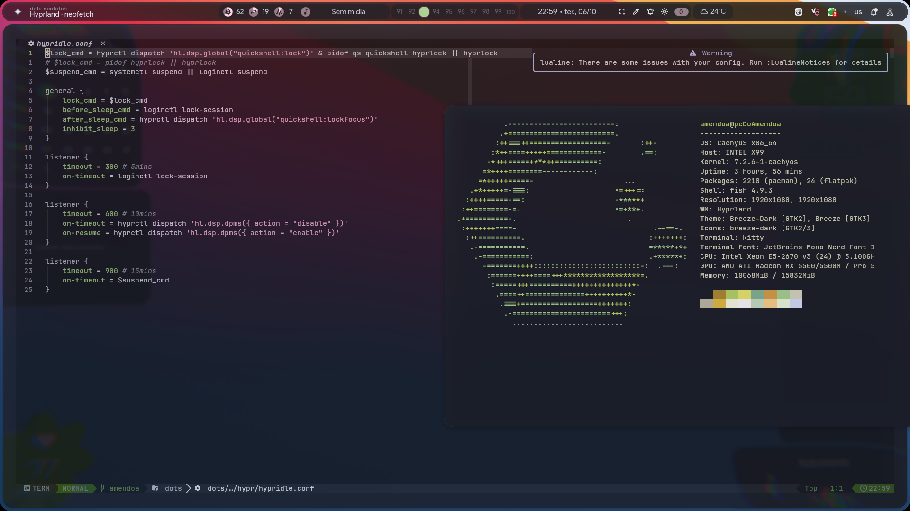

    <h1>Amendoa's Hyprland dotfiles</h1>
    
Um desktop Linux pessoal, dinâmico e construído para trabalhar rápido.

## Meu setup

Este repositório reúne a configuração do meu desktop Linux com Hyprland, Quickshell, Kitty e Neovim. O objetivo é combinar produtividade, automação e uma interface consistente, sem abrir mão da velocidade do teclado.

O visual atual segue uma linguagem de **liquid glass**: painéis translúcidos, desfoque, bordas arredondadas, sombras suaves e cores derivadas do wallpaper. Cada camada permanece integrada ao desktop, em vez de parecer uma janela solta.

## Upgrades atuais

- **Matugen em todo o desktop**: o wallpaper gera a paleta usada pela barra, painéis, widgets e terminal.
- **Widgets de fundo**: calendário, relógio, clima, status do celular, contador pessoal, dock e controle de mídia ficam incorporados ao wallpaper.
- **Galeria do celular via Wi‑Fi**: um widget acessa os álbuns da galeria do celular através do KDE Connect e exibe essas imagens no desktop.
- **Bateria na barra superior**: um widget dedicado mostra o nível da bateria do celular diretamente na barra.
- **Liquid glass**: transparência, blur, profundidade e contraste equilibrados criam um acabamento moderno sem prejudicar a leitura.
- **Painel lateral inteligente**: `Super`+`A` abre recursos de IA, tradução e ferramentas auxiliares sem tirar o foco do workspace.
- **Folha de atalhos**: `Super`+`/` mostra os atalhos de shell, janelas, mídia, screenshots, workspaces e sessão.
- **Fluxo de desenvolvimento**: Neovim para editar a configuração, Kitty como terminal e terminal flutuante centralizado para comandos rápidos e inspeção do sistema.
- **Workspaces organizados**: cada workspace pode ficar dedicado a uma tarefa, com o shell e os widgets sempre disponíveis no fundo.

## Galeria

| 4 · Matugen e widgets de fundo | 3 · Painel lateral liquid glass |
|:---:|:---:|
|  |  |
| 5 · Atalhos do sistema | 1 · Neovim e terminal flutuante |
|:---:|:---:|
|  |  |

As capturas foram feitas no sistema em execução, com a mídia limpa para destacar o wallpaper, os widgets, os painéis e o acabamento liquid glass.

## Atalhos principais

- `Super`+`Enter`: abrir o terminal.
- `Super`+`A`: abrir o painel lateral esquerdo.
- `Super`+`N`: abrir o painel lateral direito.
- `Super`+`/`: abrir a folha de atalhos.
- `Super`+`Tab`: abrir o overview de workspaces e janelas.

## Referência

Este setup usa como base e inspiração o [repositório original do end-4](https://github.com/end-4/dots-hyprland).
