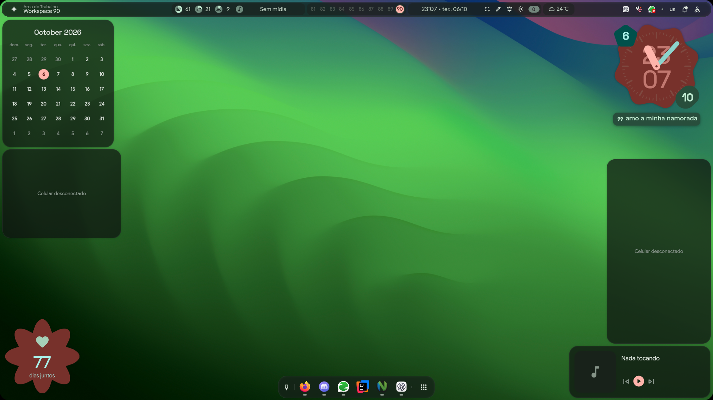
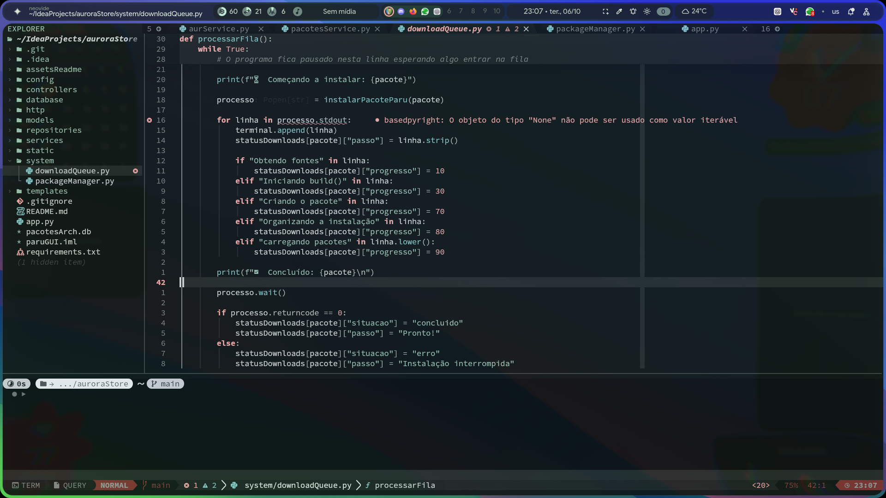
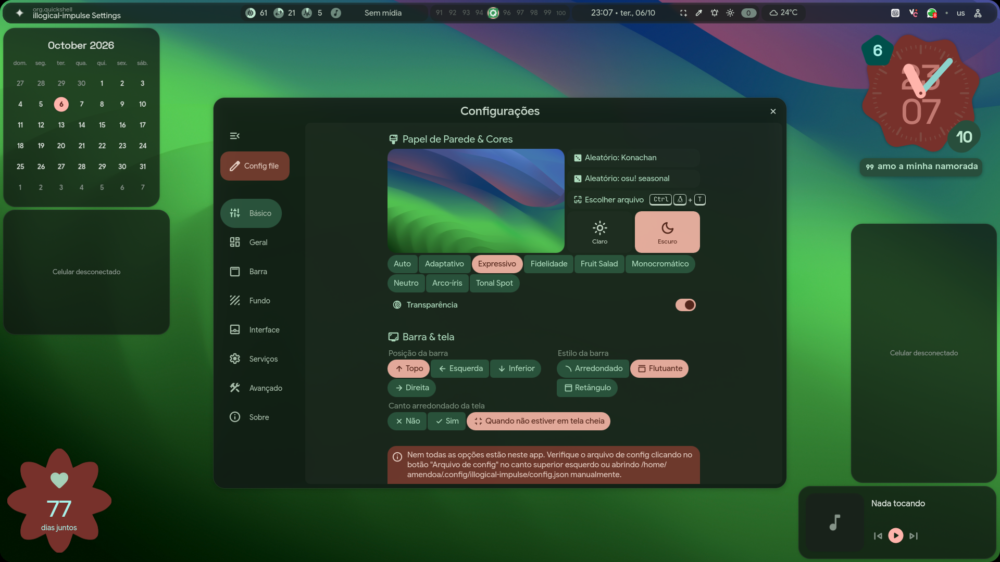
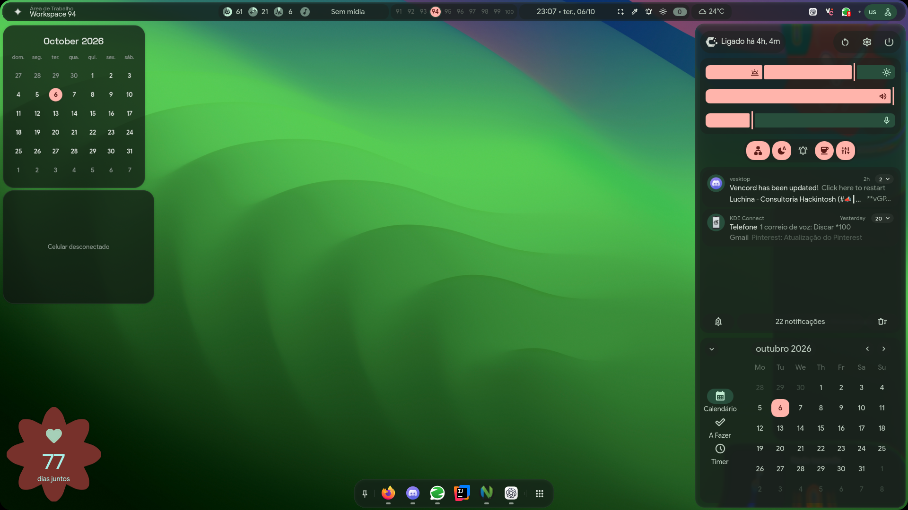
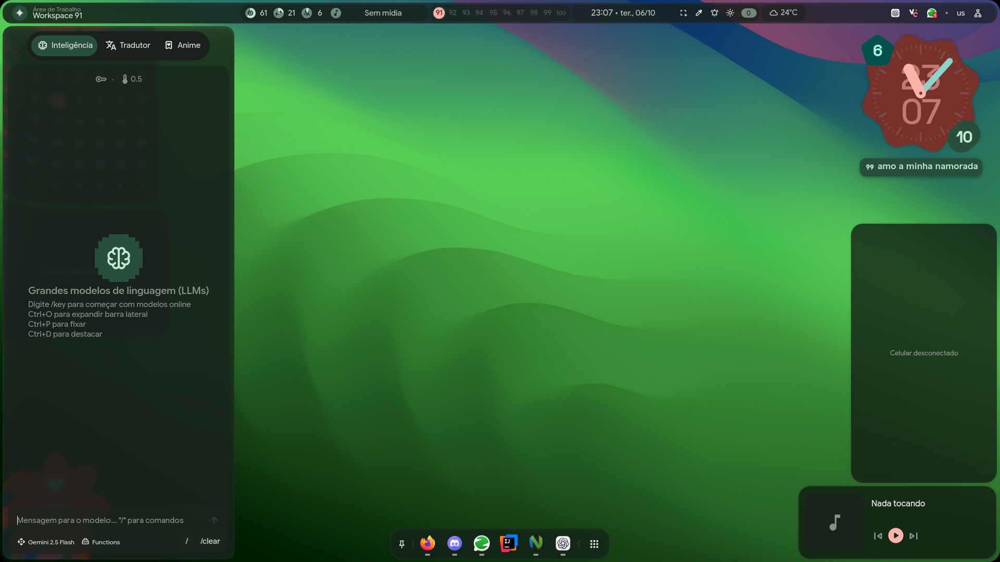
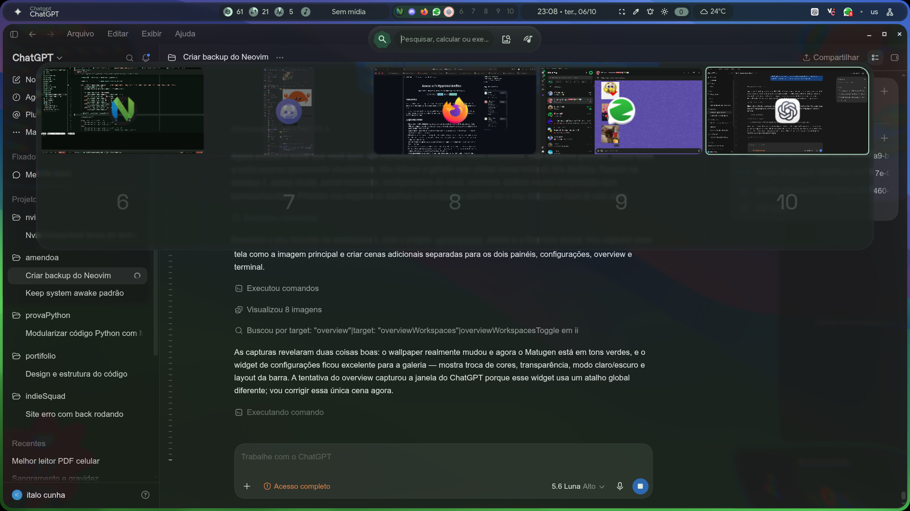
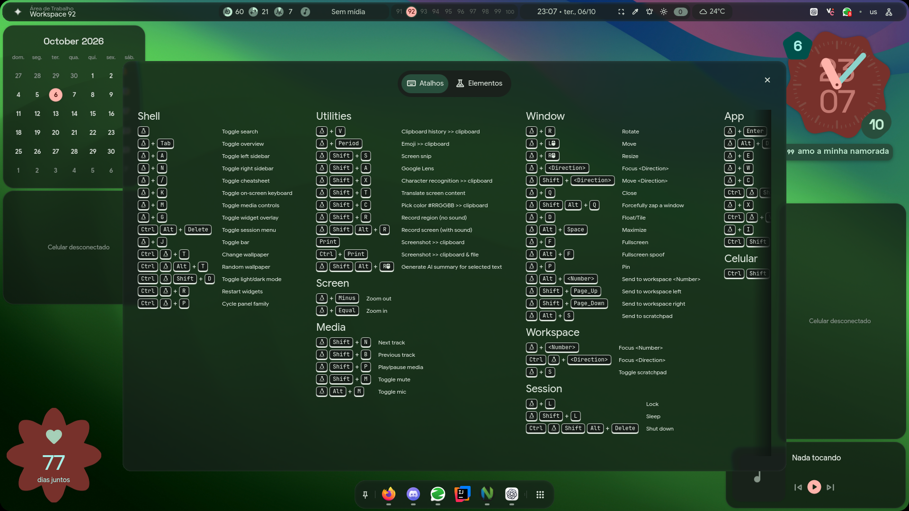
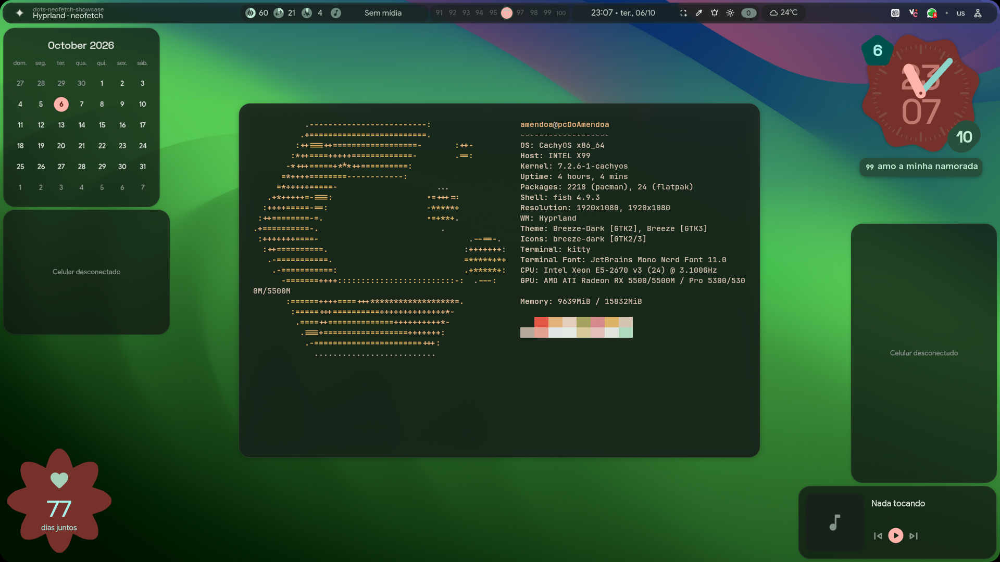

  <h1>Amendoa · Hyprland</h1>
  
<strong>Um desktop Linux vivo, modular e com liquid glass até onde a vista alcança.</strong>

  

<em>Wallpaper novo, cores geradas pelo Matugen, widgets integrados e superfícies translúcidas.</em>

## O que deixa esse desktop especial

| Visual | Integração | Fluxo |
|:---:|:---:|:---:|
| 🫧 Liquid glass blur, transparência e profundidade | 📱 KDE Connect álbuns do celular via Wi‑Fi |  Neovim + Kitty terminal flutuante e neofetch |
| 🎨 Matugen o wallpaper pinta o sistema inteiro | 🔋 Bateria na barra superior status do celular sempre visível | ⌨️ Hyprland workspaces e atalhos rápidos |

## A interface em movimento

<table>
  <tr>
    <td width="50%"></td>
    <td width="50%"></td>
  </tr>
  <tr>
    <td align="center"><strong>Workspace 1 · Neovim / Neovide + Neo-tree</strong></td>
    <td align="center"><strong>Configurações · cores, transparência e barra</strong></td>
  </tr>
  <tr>
    <td width="50%"></td>
    <td width="50%"></td>
  </tr>
  <tr>
    <td align="center"><strong>Painel direito · notificações, controles e calendário</strong></td>
    <td align="center"><strong>Painel esquerdo · IA, tradutor e ferramentas</strong></td>
  </tr>
</table>

<table>
  <tr>
    <td width="50%"></td>
    <td width="50%"></td>
  </tr>
  <tr>
    <td align="center"><strong>Overview · aplicações e workspaces em uma visão</strong></td>
    <td align="center"><strong>Atalhos · o shell inteiro documentado na tela</strong></td>
  </tr>
</table>

  

<strong>Terminal flutuante centralizado · Kitty + neofetch</strong>

## Atalhos que importam

`Super`+`Enter` terminal · `Super`+`A` painel esquerdo · `Super`+`N` painel direito · `Super`+`/` atalhos · `Super`+`Tab` overview · `Super`+`I` configurações

## Referência

Configuração baseada e inspirada no [repositório original do end-4](https://github.com/end-4/dots-hyprland).
